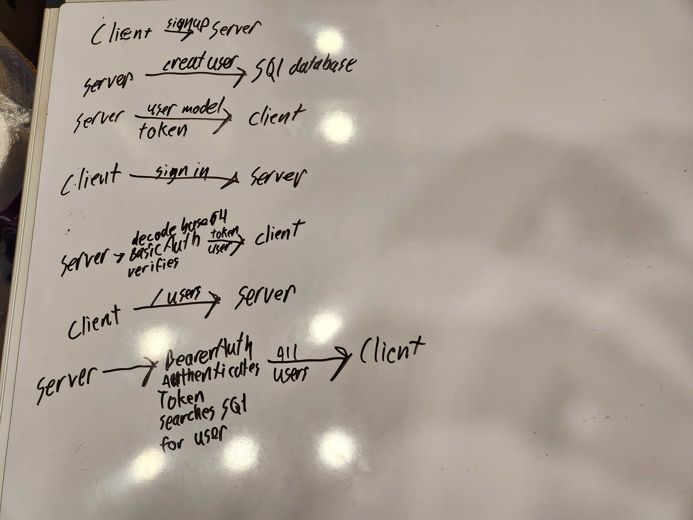

# bearer-auth  

## UML  

  

### Approach  

Spent most of the time finding bugs. Put some effort into learning different ways to secure the JWT's. There is a method in the .env that is time sensitive and expires after 15 minutes.